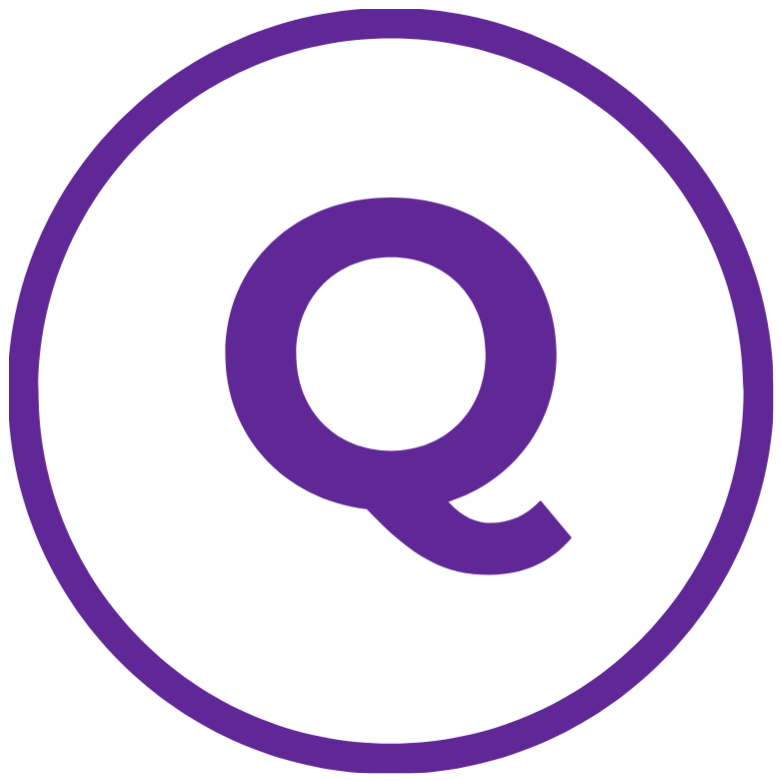

<!-- PROJECT LOGO -->
<br />
<div align="center">
  <a href="https://github.com/othneildrew/Best-README-Template">
    
  </a>

  <h3 align="center">Quizzy</h3>

  <p align="center">
    A quiz application that lets you choose what category you want to be quizzed on. Once a category is chosen you have 10 multiple choice questions to answer. You gain 2 points for getting the correct answer or you lose 2 points for getting the wrong answer, so be careful of what you choose! 
    <br />
  </p>
</div>


<!-- TABLE OF CONTENTS -->
<details>
  <summary>Table of Contents</summary>
  <ol>
    <li>
      <a href="#about-the-project">About The Project</a>
      <ul>
        <li><a href="#built-with">Built With</a></li>
      </ul>
    </li>
    <li>
      <a href="#getting-started">Getting Started</a>
      <ul>
        <li><a href="#installation">Installation</a></li>
      </ul>
    </li>
  </ol>
</details>


<!-- ABOUT THE PROJECT -->
## About The Project

Quizzy

Quiz website made using React, Redux, Redux-Thunk, Sass and the trivia API.

Features:
* Over 20 different categories can be chosen to be quizzed upon
* Scoring system to indicate how well you did
* Modern UI/UX to make the website easy to navigate
### Built With

* [![React][React.js]][React-url]
* 
* 
* 
* 

### Installation

1. Clone the repo
   ```sh
   git clone https://github.com/Muqto/Quizzy.git
   ```
2. cd into the new folder and install NPM packages
   ```sh
   npm install
   ```
3. To run the React project
    ```sh
   npm start
   ``` 

<!-- GETTING STARTED -->

<p align="right">(<a href="#readme-top">back to top</a>)</p>

[React.js]: https://img.shields.io/badge/React-20232A?style=for-the-badge&logo=react&logoColor=61DAFB
[React-url]: https://reactjs.org/
